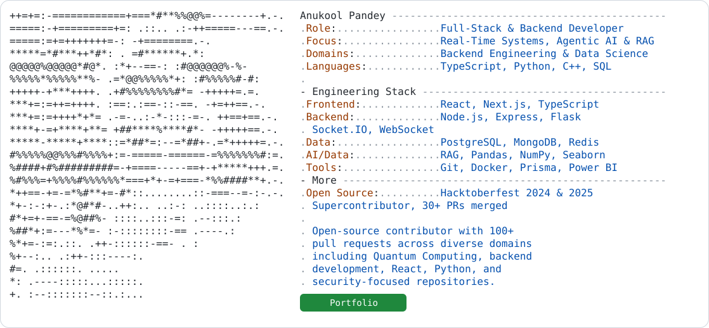

<a href="https://github.com/ANUKOOL324/ANUKOOL324">
  <picture>
    <source media="(prefers-color-scheme: dark)" srcset="./dark_mode.svg">
    
  </picture>
</a>

---

### About Me
- Third-year **Electronics and Communication Engineering** student at **UIET, Panjab University**
- Focused on **full-stack** and **backend** development
- Currently building **KrishiSaarthi**, a multi-agent farm risk & market planning dashboard

### Tech Stack

  
  
  
  
  
  
  
  

### GitHub Stats

  
  

