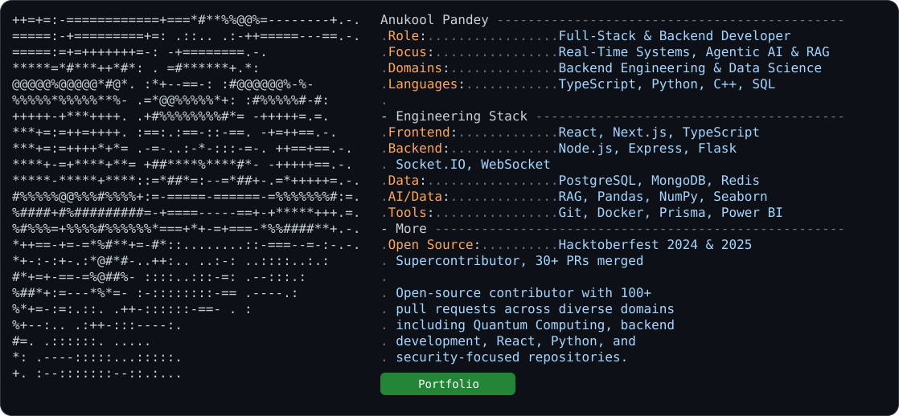

<a href="https://github.com/ANUKOOL324"> <picture> <source media="(prefers-color-scheme: dark)" srcset="./dark_mode.svg"> <source media="(prefers-color-scheme: light)" srcset="./light_mode.svg">  </picture> </a>
